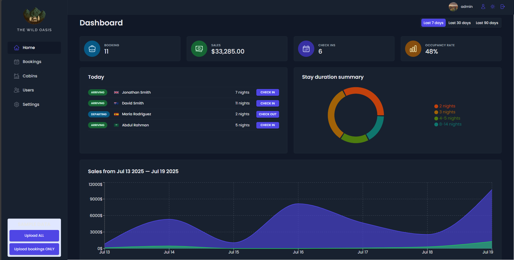

# The Wild Oasis – Hotel Management Dashboard

## Description

The Wild Oasis is a modern, secure hotel management dashboard built for internal staff use. It streamlines daily operations by enabling staff to manage guest bookings, check-ins and check-outs, cabin inventory, user accounts, and hotel-wide settings. With a clean interface and interactive charts, it also delivers key business insights to support better decision-making.

---

## Usage

The Wild Oasis dashboard is built for hotel administrative teams to handle daily tasks such as:

- Managing bookings and guest information
- Checking guests in and out
- Updating cabin listings and pricing
- Adjusting hotel policies and settings
- Creating and managing staff user accounts
- Monitoring sales, occupancy rates, and booking trends through charts and filters

  **Note**: As this is a GitHub-only project, the admin login credentials have been intentionally left in for demonstration purposes. The change password feature is disabled to prevent modifications. Feel free to log in, and explore the dashboard.

---

## Features

### Secure Login System

- Email/password authentication via Supabase
- Email confirmation required for login
- Route protection for authenticated users only

### Dashboard Overview

- View Total Sales, Bookings, Check-ins, and Occupancy Rate
- Daily arrivals and departures
- Interactive charts:
  - Pie Chart (Stays Summary)
  - Area Chart (Sales and Extras like Breakfast)
- Time filters: Last 7, 30, 90 days

### Bookings Management

- View bookings by cabin, guest, dates, and status (Unconfirmed, Checked-in, Checked-out)
- Booking actions: Check-in, Add Breakfast, Check-out, Delete
- Filter and sort bookings
- URL search params persist filters/sorts
- Pagination with React Query prefetching

### Cabin Management

- Full CRUD operations for cabin listings
- Filter by discount status
- Sort by name, price, and capacity

### User Management

- Admins can create new user accounts
- Users can update profile image, name, and password

### Settings

- Update hotel bookings:
  - Breakfast price
  - Min/Max nights per booking
  - Max guests per booking

### Theme Support

- Light/Dark mode toggle

---

## Technologies Used

### Frontend

- **React**
- React
- React Router
- React Query
- React Hook Form
- Styled Components
- Recharts
- Toast notifications

### Backend / Database

- **Supabase**
  - Authentication
  - Row Level Security (RLS)
  - File Storage
  - Tables: `bookings`, `cabins`, `guests`, `settings`

---

## Screenshot

---

## The Website

[Live Demo – Visit The Wild Oasis](https://www.thewildoasis.xyz)

---

## Acknowledgement

This site was built as part of the **Ultimate React Course by Jonas Schmedtmann**.

---

## License

MIT License  
(Please refer to the [LICENSE](./LICENSE))
